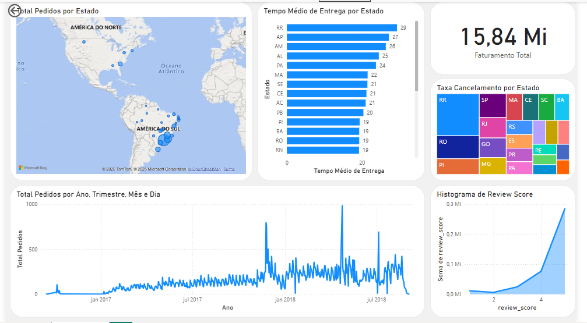

# **Brazilian E-commerce Analysis**  
Este projeto analisa dados de um **e-commerce brasileiro** utilizando **SQL** para extração e manipulação de dados e **Power BI** para visualização e geração de insights.  

A base de dados utilizada é do **Olist**, um marketplace brasileiro, e contém informações sobre:
- 📦 **Pedidos e Entregas**  
- ⭐ **Avaliações dos Clientes**  
- 🛒 **Produtos e Categorias**  
- 📊 **Vendedores e Pagamentos**  

📌 **Objetivo:** Explorar esses dados para identificar padrões, tendências e insights relevantes para o negócio.

---

## **📦 Pedidos e Entregas**

### 🕒 **Qual o tempo médio entre a compra e a entrega dos pedidos?**
> **🏷️ Resultado:** **12,09 dias**.  

📌 A entrega mais demorada pode impactar a experiência do cliente e as avaliações.

---

### ❌ **Qual a taxa de pedidos cancelados?**
> **🏷️ Resultado:** **0,63%** dos pedidos são cancelados.  

📌 Uma taxa relativamente baixa, mas que pode indicar problemas logísticos ou insatisfação do cliente.

---

### 📍 **Quais estados/cidades têm mais pedidos?**
| Estado | Cidade               | Total de Pedidos |
|--------|----------------------|------------------|
| SP     | São Paulo            | 15.540          |
| RJ     | Rio de Janeiro       | 6.882           |
| MG     | Belo Horizonte       | 2.773           |
| DF     | Brasília             | 2.131           |
| PR     | Curitiba             | 1.521           |
| SP     | Campinas             | 1.444           |
| RS     | Porto Alegre         | 1.379           |
| BA     | Salvador             | 1.245           |
| SP     | Guarulhos            | 1.189           |
| SP     | São Bernardo do Campo| 938             |

📌 O **Sudeste lidera as vendas**, com São Paulo sendo a cidade com maior volume de pedidos.

---

## **⭐ Avaliações dos Clientes**

### ⭐ **Qual a distribuição das notas das avaliações?**
| Nota | Total de Avaliações |
|------|---------------------|
| 5    | 56.909             |
| 4    | 19.007             |
| 3    | 8.097              |
| 2    | 3.114              |
| 1    | 11.282             |

📌 **Avaliações 5 estrelas dominam**, mas há um número expressivo de notas baixas.

---

### ⏳ **Há relação entre tempo de entrega e a nota da avaliação?**
| Nota | Tempo Médio de Entrega (dias) |
|------|------------------------------|
| 1    | 20,89                        |
| 2    | 16,19                        |
| 3    | 13,79                        |
| 4    | 11,84                        |
| 5    | 10,21                        |

📌 Quanto mais rápida a entrega, **melhores as avaliações**. Pedidos com nota 1 demoraram, em média, **20 dias** para serem entregues.

---

### 📝 **Quais palavras mais aparecem nos comentários das avaliações?**
| Palavra  | Ocorrências |
|----------|------------|
| produto  | 12.979     |
| do       | 8.116      |
| não      | 6.939      |
| antes    | 4.840      |
| entrega  | 4.365      |
| chegou   | 4.319      |
| prazo    | 4.048      |
| Recebi   | 3.984      |
| que      | 3.920      |
| no       | 3.137      |
| foi      | 2.980      |
| entregue | 2.721      |
| bem      | 2.232      |
| VEIO     | 2.216      |
| comprei  | 2.054      |

📌 **"Entrega", "prazo" e "chegou"** indicam que **tempo de entrega** impacta a experiência do cliente.

---

## **🛒 Produtos e Categorias**

### 🔥 **Quais categorias de produtos vendem mais?**
| Categoria                | Total de Pedidos |
|--------------------------|------------------|
| cama_mesa_banho         | 10.953           |
| beleza_saude            | 9.465            |
| esporte_lazer           | 8.431            |
| moveis_decoracao        | 8.160            |
| informatica_acessorios  | 7.644            |

📌 Produtos de **casa, beleza e esporte** são os mais vendidos.

---

### 💰 **Qual o ticket médio (preço médio) por categoria?**
| Categoria                                    | Ticket Médio (R$) |
|----------------------------------------------|-------------------|
| pcs                                          | 1.098,34         |
| portateis_casa_forno_e_cafe                  | 624,29           |
| eletrodomesticos_2                           | 476,12           |
| agro_industria_e_comercio                    | 342,12           |
| instrumentos_musicais                         | 281,62           |

📌 **Eletrônicos e eletrodomésticos** possuem os maiores valores médios.

---

### 🔄 **Quais produtos têm mais devoluções?**
| Categoria               | Produto ID                          | Devoluções |
|-------------------------|------------------------------------|------------|
| moveis_decoracao       | 5c3eaf54e8ee5d5378765ff16df7640b  | 6          |
| ferramentas_jardim     | 8397dc503d1a0c2ac7422701884de5a6  | 6          |
| utilidades_domesticas  | c3a52053718435a35e070b991ff546ec  | 5          |

📌 **Móveis e decoração lideram em devoluções**, possivelmente devido a problemas de qualidade ou transporte.

---

## **📊 Vendedores e Pagamentos**

### 💸 **Qual o faturamento total e médio por vendedor?**
| Vendedor ID                           | Faturamento Total (R$) | Ticket Médio (R$) |
|----------------------------------------|----------------------|-------------------|
| 4869f7a5dfa277a7dca6462dcf3b52b2       | 229.472,63          | 198,51           |
| 53243585a1d6dc2643021fd1853d8905       | 222.776,05          | 543,36           |

📌 Os vendedores com maior faturamento **têm ticket médio alto e grande volume de vendas**.

---

### 💳 **Qual a forma de pagamento mais utilizada?**
| Método de Pagamento | Total de Transações | Percentual (%) |
|---------------------|--------------------|---------------|
| credit_card        | 76.795             | 73,92%        |
| boleto             | 19.784             | 19,04%        |
| voucher            | 5.775              | 5,56%         |
| debit_card         | 1.529              | 1,47%         |

📌 **Cartão de crédito é disparado o mais usado**, seguido por **boleto**.

---

### ✅ **Qual a taxa de aprovação dos pagamentos?**
> **🏷️ Resultado:** **97,02%** dos pagamentos foram aprovados.  

📌 Uma taxa **alta**, indicando que a maioria dos clientes conclui a compra sem problemas.

Segue abaixo uma pré-visualização do dashboard gerado no Power BI:

